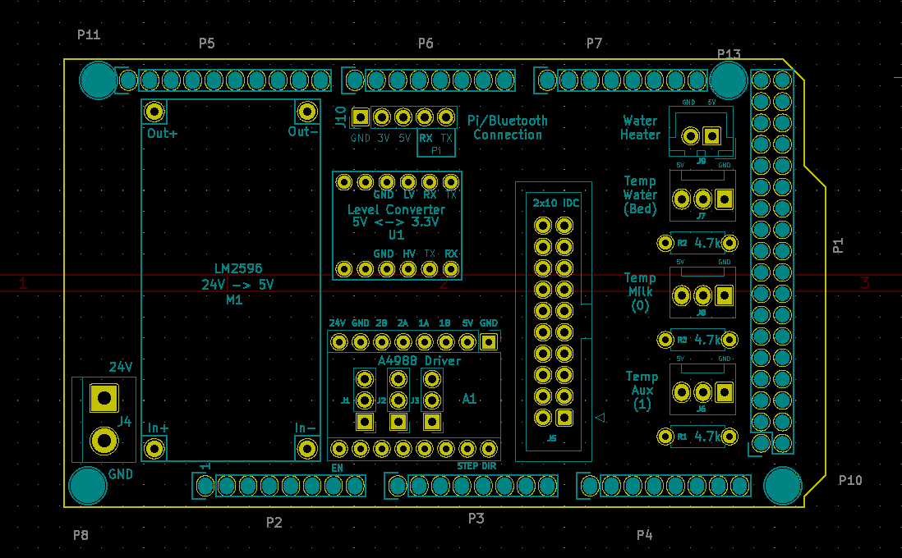
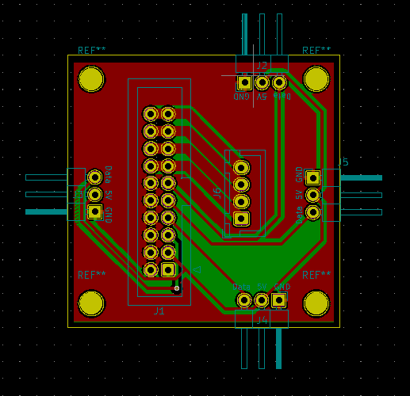

# CheeseMaker-Circuit

This is the circuit board for the hardware that controls the stirring machine. On top of this circuit you'll need:

- A stepper driver, e.g. A4988
- 1-2 DS18B20 Temperature Sensors
- SSR for switching on Water Heater (Kettle Element)
- Arduino Mega 2560
- 3x 4.7 kohm resistors
- LM2596 DC to DC Buck Converter (Convert input voltage to 5V)
- Connectors (or plain pin headers) - I used JST-XH socket for the stepper output, KF2510 for the temp sensor input

Notes:

- The schematics assume 24V input. This is because my stepper was 24V. Note that Arduino Mega 2560 isn't 24V tolerant which is why the LM2596 is required.

## CheeseDistribution
To reduce the jitter on the servos this second circuit was developed to sit on the stirrer arm servo and distribute all the connections out to the stepper and servo.

The connection between this board and the main one is via a 20 pin IDC cable.

